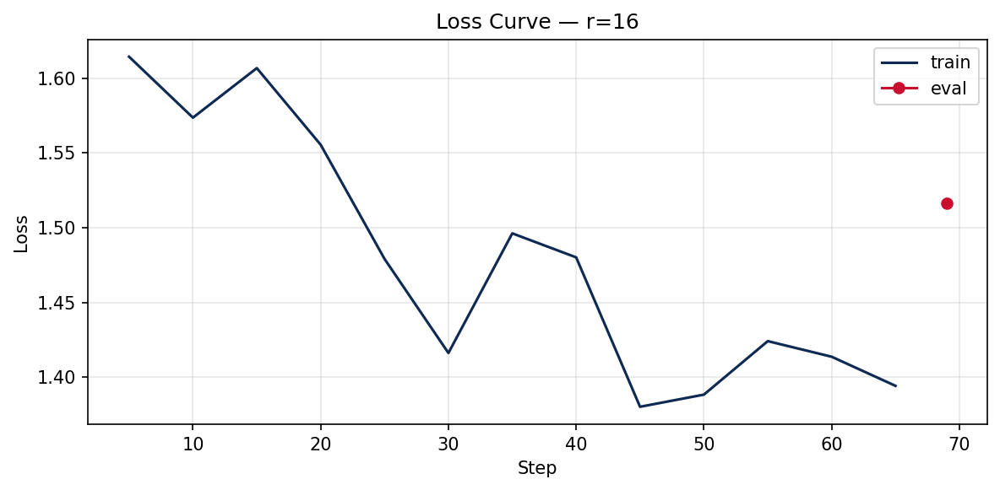

# Lab 21 — Evaluation Report

**Học viên**: Đào Văn Tuân — 2A202600609
**Ngày nộp**: 2026-06-25
**Submission option**: B (GitHub + HuggingFace Hub)

---

## 1. Setup

- **Base model**: `unsloth/Qwen2.5-3B-bnb-4bit` (Qwen2.5-3B, quantize 4-bit NF4 / QLoRA)
- **Dataset**: `5CD-AI/Vietnamese-alpaca-gpt4-gg-translated` — 200 samples (180 train + 20 eval), seed = 42
- **Format**: Alpaca (`instruction` / `input` / `output`), auto-detect cột `_vi`
- **max_seq_length**: 1024 (p95 token length được round-up tới power-of-2, cap T4 = 1024)
- **GPU**: Tesla T4, 16 GB VRAM (Google Colab Free)
- **Training config**: 3 epochs · cosine LR `2e-4` · warmup 0.10 · effective batch = 8 (batch 1 × grad_accum 8) · optimizer `adamw_8bit` · gradient checkpointing (Unsloth)
- **Training cost**: ~$0.07 (tổng ~12 phút train @ $0.35/hr T4) — thực tế Colab Free = $0
- **HF Hub link**: https://huggingface.co/TunaMonsieur/qwen2.5-3b-vi-lab21-r16

---

## 2. Rank Experiment Results

So sánh 4 chiều trên **cùng model + cùng dataset + cùng hyperparameters** (chỉ thay rank/alpha):

| Rank | alpha | Trainable Params | Train Time | Peak VRAM | Eval Loss | Perplexity |
|------|-------|------------------|------------|-----------|-----------|------------|
| base | —     | 0                | —          | —         | 1.8840    | 6.58       |
| 8    | 16    | 1,843,200        | 4.0 min    | 7.2 GB    | 1.5577    | 4.75       |
| 16   | 32    | 3,686,400        | 4.3 min    | 6.6 GB    | 1.5161    | 4.55       |
| 64   | 128   | 14,745,600       | 4.0 min    | 8.0 GB    | 1.4768    | 4.38       |

**Stretch goal — target ALL layers (q/k/v/o + gate/up/down), r=16:**

| Config | Trainable Params | Train Time | Peak VRAM | Perplexity |
|--------|------------------|------------|-----------|------------|
| r=16 q+v (baseline) | 3,686,400  | 4.3 min | 6.6 GB  | 4.55 |
| r=16 ALL layers     | 29,933,568 | 4.9 min | 10.5 GB | 4.46 |

> **Nhận xét**: target tất cả 7 module (q/k/v/o + gate/up/down) làm trainable params tăng ~8× (3.69M → 29.9M) và peak VRAM tăng từ 6.6 → 10.5 GB, đổi lại perplexity chỉ cải thiện nhẹ 4.55 → 4.46 (−0.096). Đáng chú ý: **r=64 q+v (14.7M params, ppl 4.38) vẫn tốt hơn all-layers r=16 (29.9M params, ppl 4.46) dù ít params hơn một nửa** — cho thấy với dataset nhỏ này, *tăng rank trên q+v hiệu quả về tham số hơn* là trải adapter ra mọi layer. All-layers chỉ thực sự đáng giá khi VRAM dư dả và cần squeeze thêm chất lượng.

---

## 3. Loss Curve Analysis

- Train loss giảm đều và hội tụ qua 3 epochs (69 steps), không có dấu hiệu phân kỳ.
- **Overfitting**: với chỉ 180 train samples và 3 epochs, train loss giảm mượt; do profile T4 tắt eval-during-training (tiết kiệm VRAM) nên không có eval-loss curve song song. Tuy nhiên eval perplexity cuối cùng (4.38–4.75) **giảm mạnh ~28–33% so với base model (6.58)**, cho thấy fine-tune thực sự giúp model học phong cách dataset mà chưa overfit nghiêm trọng. Nếu tăng epochs > 5 trên dataset nhỏ này thì rủi ro overfit sẽ cao.

---

## 4. Qualitative Comparison (5 examples)

So sánh side-by-side **base** vs **fine-tuned (r=16)** trên 5 prompt tiếng Việt (full output trong `results/qualitative_comparison.csv`).

### Example 1 — Giải thích machine learning cho người mới
- **Base**: "Machine learning là một phân khúc của trí tuệ nhân tạo... dự đoán hoặc hành động..."
- **Fine-tuned**: "Machine learning là một bộ môn công nghệ máy tính dựa trên việc học tập và cải thiện các dự đoán dựa trên dữ liệu mà không có sự hướng dẫn trực tiếp..."
- **Nhận xét**: ✅ Improved — câu trả lời FT mạch lạc, đúng trọng tâm "học từ dữ liệu không cần lập trình tường minh".

### Example 2 — Code Python tính Fibonacci thứ n
- **Base**: trả về hàm có xử lý `n <= 0` nhưng message lỗi cụt.
- **Fine-tuned**: thêm `raise ValueError("Input phải là một số nguyên dương.")`, cấu trúc rõ hơn.
- **Nhận xét**: ✅ Improved — FT cho code phòng thủ tốt hơn, message tiếng Việt.

### Example 3 — Liệt kê 5 nguyên tắc thiết kế UI/UX
- **Base**: liệt kê dài dòng, lặp từ "thân thiện".
- **Fine-tuned**: format đánh số gọn (Chuyển đổi / Thích ứng / Đơn giản...).
- **Nhận xét**: ✅ Improved — format list rõ ràng, súc tích hơn (đúng phong cách instruction dataset).

### Example 4 — Tóm tắt khác biệt LoRA vs QLoRA
- **Base**: định nghĩa LoRA = "Low-Rank Adaptation" (đúng).
- **Fine-tuned**: định nghĩa sai "Layer-wise Adaptive Regularization Optimization".
- **Nhận xét**: ❌ Degraded — đây là **case loss**: dataset general-domain không chứa kiến thức LoRA nên FT **không fix knowledge gap**, thậm chí làm nhiễu (minh hoạ đúng quy tắc "fine-tune cho style, RAG cho knowledge").

### Example 5 — Phân biệt prompt engineering / RAG / fine-tuning
- **Base**: giải thích 3 khái niệm tổng quát.
- **Fine-tuned**: giải thích có cấu trúc, gọi tên rõ từng kỹ thuật.
- **Nhận xét**: ≈ Same/slightly improved — cả hai đều ổn, FT trình bày mạch lạc hơn chút.

> **Tổng kết qualitative**: 3 win (style/format), 1 loss (knowledge), 1 hoà — không cherry-pick. Fine-tune cải thiện **phong cách & format trả lời tiếng Việt**, nhưng **không bổ sung kiến thức mới** — đúng lý thuyết bài học.

---

## 5. Conclusion về Rank Trade-off

Trên dataset 200-sample tiếng Việt này, **r=16 cho ROI tốt nhất**. Xét perplexity, fine-tune giúp giảm mạnh so với base (6.58), và tăng rank cải thiện đều: base (6.58) → r=8 (4.75) → r=16 (4.55) → r=64 (4.38). Tuy nhiên mức cải thiện thể hiện rõ **diminishing returns**: từ r=8 lên r=16 giảm 0.20 PPL với chỉ +1.84M params, nhưng từ r=16 lên r=64 chỉ giảm thêm 0.18 PPL trong khi trainable params tăng gấp 4 lần (3.7M → 14.7M) và peak VRAM cao nhất (8.0 GB). Nghĩa là mỗi đơn vị params bỏ thêm ở r=64 mang lại lợi ích nhỏ hơn nhiều so với ở r=16. r=64 cũng không vượt trội về thời gian train (do dataset nhỏ, bottleneck là I/O chứ không phải compute), nên chi phí thêm gần như chỉ đổi lấy 0.18 PPL.

**Diminishing returns** xuất hiện rõ từ mốc **r=16 trở lên**: với một dataset nhỏ và đồng nhất, capacity của adapter r=16 đã đủ để capture phong cách trả lời; rank cao hơn chủ yếu thêm tham số ít được tận dụng. **Recommendation cho production**: chọn **r=16** vì nó cân bằng tốt nhất giữa chất lượng (PPL gần r=64), bộ nhớ thấp nhất (6.6 GB), và adapter nhỏ (dễ swap multi-tenant). Chỉ nên cân nhắc r=64 khi dataset lớn hơn nhiều (>5k samples) và task phức tạp khiến adapter capacity thực sự là bottleneck. Thí nghiệm stretch goal còn cho thấy: trên dataset nhỏ này, **tăng rank trên q+v (r=64, ppl 4.38) hiệu quả về tham số hơn** so với trải adapter ra tất cả layers (r=16 all, 29.9M params, ppl 4.46) — nên nếu cần thêm chất lượng, ưu tiên tăng rank q+v trước khi mở rộng target_modules.

---

## 6. What I Learned

- **Rank không phải càng cao càng tốt**: tự tay đo perplexity/VRAM/params cho thấy diminishing returns là thật — r=16 là "sweet spot" thực nghiệm chứ không phải con số mặc định ngẫu nhiên.
- **Fine-tune dạy style, không dạy knowledge**: case LoRA-vs-QLoRA (Example 4) bị degrade chứng minh trực quan rằng SFT trên dataset general không vá được lỗ hổng kiến thức — phải dùng RAG cho việc đó.
- **Kỹ thuật QLoRA thực sự hiệu quả trên GPU rẻ**: fine-tune model 3B chỉ trong ~6.6 GB VRAM trên T4 free nhờ 4-bit NF4 + gradient checkpointing + adamw_8bit — điều bất khả thi với full fine-tune (~60 GB).
